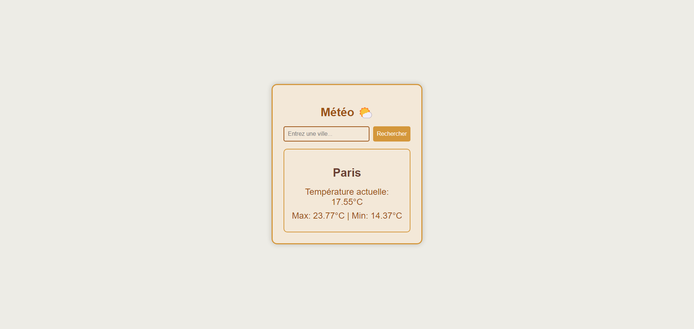

# FreeLiveWeather

FreeLiveWeather is a simple and elegant weather application built using **HTML**, **CSS**, and **JavaScript**. It retrieves real-time weather data from the **MeteoBlue API** and allows users to search for the current weather in different cities. The app displays the current temperature along with the minimum and maximum temperatures for the day.

## Features

- Displays current temperature for any city.
- Shows maximum and minimum temperatures for the day.

## Getting Started

To run this project locally, follow the instructions below:

### Prerequisites

- **Git**: Make sure Git is installed on your machine.
- **API Key from MeteoBlue** : You need to sign up for an API key from [MeteoBlue](https://www.meteoblue.com/).

### Installation

1. **Clone the repository** :

   ```bash
   git clone https://github.com/nmoussaoui-epsi/FreeLiveWeather.git
   cd FreeLiveWeather
   ```

2. **Get an API key from MeteoBlue** :

   - Visit MeteoBlue and sign up for an account.
   - Go to the API section and request an API key.
   - Once you receive your API key, store it safely.

3. Store your API key:

   - Add your API key to the file as shown below:
     ```javascript
     const apiKey = "YOUR_API_KEY";
     ```

4. Open the project: You can simply open the index.html file in your browser to run the app locally.

### Usage

1. **Search for a city** :
   - Use the search bar to enter any city name, and the app will display the current temperature as well as the max and min temperatures for the day.
2. **View default weather (Paris)** :
   - On page load, the weather for Paris will be displayed by default.

### Screenshots



### Contact Information

Feel free to reach out if you have any questions or feedback.

- [Portfolio](https://www.nassim-moussaoui.fr)
- [LinkedIn](https://www.linkedin.com/in/moussaouinassim/)
